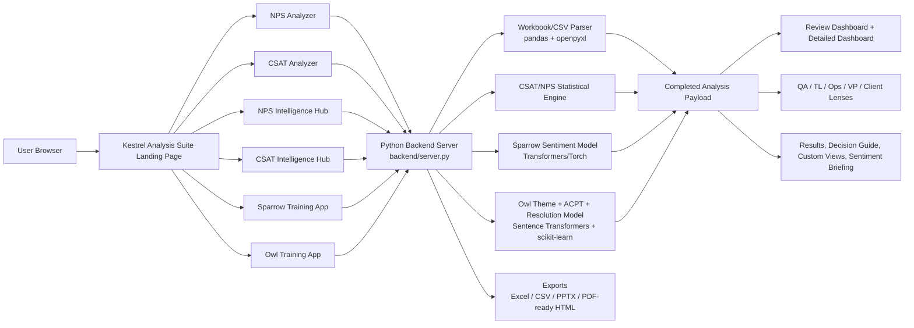
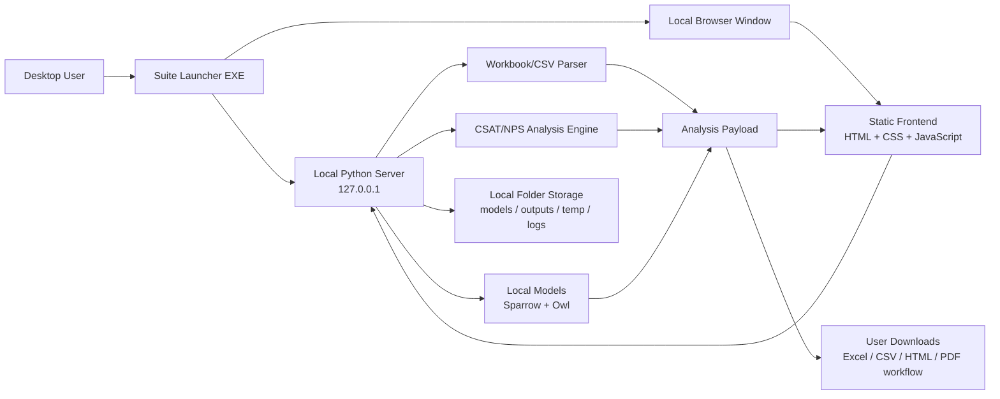
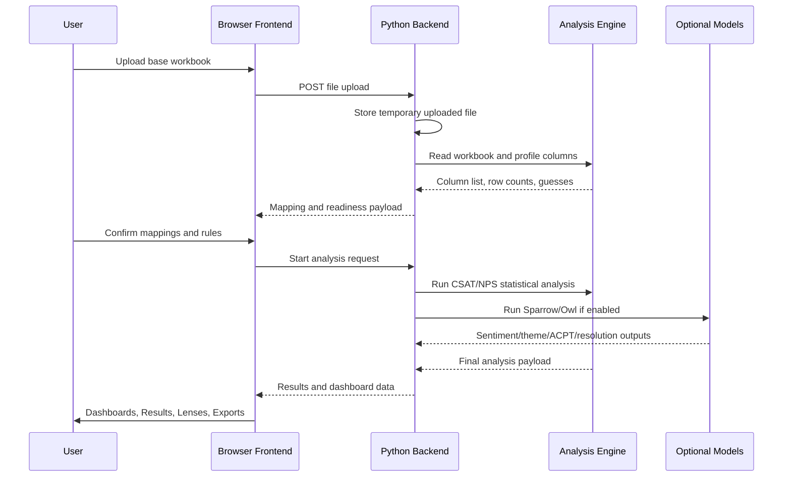

# CX Intelligence Suite - Architecture Overview

Prepared for IT review  
Version scope: IntelligenceSuite-WebVersion and equivalent desktop packaging approach  
Last updated: 2026-07-01

## 1. High-Level Purpose

CX Intelligence Suite is a customer feedback analysis toolkit for CSAT and NPS programs. It accepts survey workbooks, validates column mappings, runs score/statistical analysis, optionally applies local ML models for sentiment and verbatim classification, and produces dashboards, lens-based readouts, exports, and training utilities.

The same functional modules are intended to exist in two deployment forms:

- Web version: hosted as a Python web service, currently configured for Render.
- Desktop version: packaged as a local standalone application using bundled Python/runtime components so users do not need to install Python separately.

## 2. Web Version Architecture

## 3. Desktop Version Architecture

## 4. Main Runtime Components

| Layer | Component | Responsibility |
|---|---|---|
| Presentation | HTML/CSS/JavaScript | User interface, guided setup, dashboard rendering, result tabs, lens views, popups, client-side interactions |
| Backend API | Python `backend/server.py` | HTTP server, file upload handling, route handling, model status, training launcher, analysis orchestration |
| Analysis Engines | Python analyzer modules | CSAT/NPS scoring, satisfaction/promoter grouping, weekly trends, statistical questions, rankings, volatility, lens payloads |
| Data Processing | pandas/openpyxl | Excel/CSV reading, column profiling, row preparation, export workbooks |
| Sparrow | Transformers/Torch model | Optional local sentiment classification |
| Owl | Sentence Transformers + scikit-learn/joblib | Optional Theme, ACPT, and Resolution Status classification |
| Exports | Python + frontend HTML | CSV, Excel, PowerPoint-related support, print/PDF-ready HTML output |
| Deployment | Render / Desktop EXE | Web service hosting or local standalone execution |

## 5. Data Flow

## 6. Key Functional Modules

- Landing page: route selection for analyzers, training tools, and suite modules.
- NPS Analyzer: guided NPS workflow, NPS calculation, promoter/passive/detractor logic, NPS-specific dashboard and readouts.
- CSAT Analyzer: guided CSAT workflow, satisfied/neutral/dissatisfied logic, CSAT-specific dashboard and readouts.
- Intelligence Hubs: detailed dashboards for executive, agent, manager, custom dashboards, themes, ACPT, sentiment, and performance views.
- Decision Guide: compact yes/no/unclear operational question table with information popups.
- Results: calculation/audit cards and evidence popups.
- Insights Readout: QA Lens, TL Lens, Operations Manager Lens, VP Lens, and Client Lens.
- Sparrow Training: sentiment model training workspace.
- Owl Training: Theme, ACPT, and Resolution Status model training/testing workspace.

## 7. Storage and Data Handling

| Folder | Purpose |
|---|---|
| `models/` | Bundled or referenced model files. For web deployment, large trained models should normally be externalized or stored on persistent disk. |
| `outputs/` | Generated outputs where applicable. |
| `temp/` | Temporary processing files. |
| `logs/` | Runtime logs and diagnostics. |
| `UAT_Documents/` | Testing, IT, and user documentation. |

For the web version, user-trained model artifacts should not normally be committed to Git. If long-term web retention is required, use Render persistent disk or external storage.

## 8. Deployment Model

### Web Version

Configured by `render.yaml`:

- Runtime: Python
- Python version: 3.11.9
- Build command: `pip install --upgrade pip && pip install -r requirements.txt`
- Start command: `python backend/server.py`
- Health path: `/healthz`

### Desktop Version

Expected packaging pattern:

- Local launcher EXE starts a local Python-backed server.
- Browser opens local UI served from `127.0.0.1`.
- Python/runtime dependencies are bundled with the package.
- User does not need to install Python manually.

## 9. Security Notes for IT

- The analyzer is designed to process uploaded files through the application backend.
- Desktop processing stays on the local machine.
- Web processing depends on hosted environment controls, storage policy, and access policy.
- No GenAI API call is required for the core analysis logic described here.
- Sparrow and Owl are local ML models when enabled.
- Trained model artifacts may contain derived information from training data; they should be handled as controlled application data.

